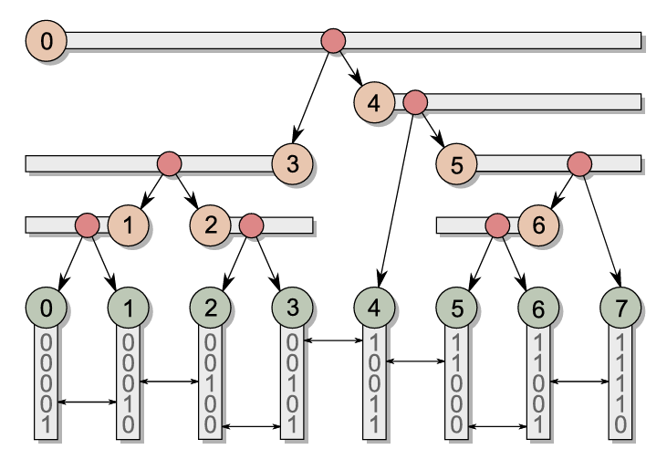

# Linear BVH

## Introduction

BVH (Bounding Volume Hierarchy) is a data structure used in ray tracing to accelerate the intersection test between rays and objects. Today we talk about one kind of BVH for collision detection, which is called Linear BVH.

The original idea is from this NVIDIA Blog from Karras. The most significant idea is we make **any parallelizable step in construction and traversal** processed in parallel on GPU.

The final shape of LBVH is shown below:

## Construction

We use a *Bottom-Up* method to construct the LBVH. The construct process is divided into following steps:

+ **1. initialize the primitives**. Find the most efficient way to initialize the infomations of leaf nodes, including the verts or vert_indexes.
+ **2. calculate the leaf AABB**. Calculate the AABB of each leaf node. Each leaf node stimulates a GPU thread.
+ **3. calculate the leaf Morton code**. Calculate the Morton code of each leaf node, using the centroid of the AABB for encoding. Each leaf node stimulates a GPU thread.
+ **4. radix sort the leaf nodes using Morton code as key**. We use the thrust library to sort the leaf nodes. Note that we use SORT-then-SWAP method to avoid the cache miss, as shown in [CUDA Tips/With thrust or sort library](./001-CUDA_tips).
+ **5. generate hierarchy**. Determine the range and split of each internal node in parallel.
+ **6. calculate the internal AABB**. Each leaf node stimulates a GPU thread. They go up, rewriting the AABB of their parent node if arrive at the first, or merging with the parent if arrive at the second.

The current bottleneck is the radix sort step. However, if the pre-steps of the collision detection are on CPU(host), the bottleneck will be the first step, initializing the primitives.

## Traversal

Given that LBVH is a tree-shaped data structure. We can use the thinking of iterative traversal. Noting that we cannot use recursion in GPU, we use a manually stack to store the nodes remaining to be visited.

The traversal process is divided into following steps:

+ **1. initialize the stack**. We initialize the stack with the stack bottom `-1` and the root node index `0`.
+ **2. traverse the tree**. It is a common way for manually recursive simulation. We traverse the tree in a while loop. In each iteration, we travel the current node to check if the queried node's AABB overlaps the current node's left or right child's AABB. If both, we push the right child index into the stack and move to the left child. If only one, we move to the child directly. If none, we pop the stack to get the next node to visit.
+ **3. candidates fetch**. When the traversal arrives the leaf node, and the leaf's AABB overlaps the queried AABB, we add the pair into the candidates list. We can also utilize a bitmap to avoid using atomicAdd while accelerating the list's index.

## Conclusion

The LBVH is a good choice for collision detection, especially for large scenes. However, considering the nature of the tree structure, the traversal process is not as efficient as we expected.  
